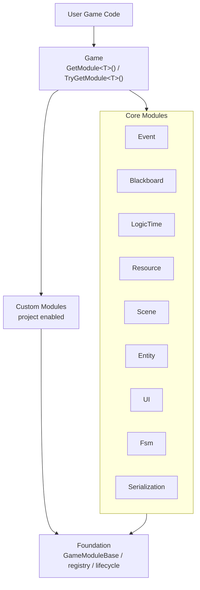

# XiheFramework

XiheFramework is a modular Unity runtime framework. It is built around a small foundation layer, replaceable core modules, project-owned custom modules, explicit assembly definitions, and archived legacy code that is kept out of compilation.

The current design favors clear framework boundaries over broad static convenience APIs. Projects should depend on module interfaces such as `IXiheEventModule` and `IXiheEntityModule`, then choose concrete implementations from `GameManager`.

## Architecture



This diagram is a learning map, not the full asmdef dependency graph. User code enters through `Game`, retrieves core or custom modules with `Game.GetModule<T>()`, and does not need to depend on module startup internals.

## Folder Layout

```text
Assets/XiheFramework
  Runtime
    Foundation
      Base
      DataStructure
    Modules
      Core
        Event
        Blackboard
        LogicTime
        Resource
        Scene
        Entity
        UI
        Fsm
        Serialization
      Custom
        Audio
        Input.Legacy
    Utilities
  Editor
    Core
    Modules
    Tools
  Archive~
  Samples~
```

`Archive~` contains retired modules and legacy utilities. Unity ignores folders ending with `~`, so archived code is kept for reference but is not part of active compilation.

## Assembly Rules

Every active framework area has an `.asmdef`. Do not put new framework runtime code into `Assembly-CSharp`.

Assembly rules:

- `Runtime/Foundation` contains the framework foundation layer.
- `XiheFramework.Core` is the foundation assembly and owns `Game`, `GameManager`, `GameModuleBase`, startup order, module registration, and shared base data structures.
- `Runtime/Modules/Core` contains the core module set created by `GameManager`.
- Each core module owns its own interface and implementation in the same module folder.
- Public module interfaces and module classes use the `Xihe` prefix: `IXiheEventModule`, `XiheEventModule`, `IXiheEntityModule`, `XiheEntityModule`.
- Project-specific modules should live in project assemblies, not inside `Assets/XiheFramework`, unless they are intended to become reusable framework modules.
- Runtime assemblies must not reference `UnityEditor`.
- Editor tooling lives under `Editor/Core`, `Editor/Modules`, or `Editor/Tools`.

## Core Modules

Core modules are the default framework capability contracts. Concrete implementations marked with `XiheCoreModuleAttribute` can be created by `GameManager` at runtime.

| Module | Interface | Built-in Implementation | Notes |
| --- | --- | --- | --- |
| Event | `IXiheEventModule` | `XiheEventModule` | String event bus using `EventHandler<object>`. |
| Blackboard | `IXiheBlackboardModule` | `XiheBlackboardModule` | Shared runtime blackboards. |
| LogicTime | `IXiheLogicTimeModule` | `XiheLogicTimeModule` | Global time-scale events and logic-time control. |
| Resource | `IXiheResourceModule` | `XiheResourceModule` | Addressables-backed runtime loading when `USE_ADDRESSABLE` is enabled. |
| Scene | `IXiheSceneModule` | `XiheSceneModule` | Addressables scene loading when `USE_ADDRESSABLE` is enabled. |
| Entity | `IXiheEntityModule` | `XiheEntityModule` | Entity registration, lifecycle, pooling-facing APIs, and entity events. |
| UI | `IXiheUIModule` | `XiheUIModule` | Page, pop, overlay, and UI entity orchestration. |
| Fsm | `IXiheStateMachineModule` | `XiheStateMachineModule` | State machine registration and update. |
| Serialization | `IXiheSerializationModule` | `XiheSerializationModuleBase` | Abstract base only; projects provide a concrete persistence module when needed. |

Serialization currently provides the contract and base class but no built-in concrete module. It will not appear in the `GameManager` core module dropdown until the project or framework adds a non-abstract implementation marked with `[XiheCoreModule(typeof(IXiheSerializationModule))]`.

Each concrete core implementation that should appear in `GameManager` is marked with:

```csharp
[XiheCoreModule(typeof(IXiheEventModule))]
public class XiheEventModule : GameModuleBase, IXiheEventModule {
}
```

The attribute tells the `GameManager` editor which interface the implementation satisfies. The inspector displays the contract using a short name, such as `Event` or `Blackboard`.

## GameManager

Every scene that boots the framework needs one `GameManager`.

`GameManager` is responsible for:

- creating enabled core modules from the selected implementation classes;
- registering all modules into `Game`;
- instantiating project custom module prefabs;
- applying the global framework debug toggle;
- preserving module startup order through `GameModuleBase.Priority`.

Important inspector fields:

- `Game Name`: human-readable project/framework instance name.
- `Enable Framework Debug`: global debug state applied to modules created by the manager.
- `Auto Create Core Modules`: creates enabled core modules at runtime.
- `Core Modules`: one row per core module contract; choose the implementation class from the dropdown.
- `Custom Game Module Prefabs`: explicit prefab list for non-core modules, including project modules and framework custom modules.

Selected concrete core modules are created directly from implementation types at runtime. They do not use active prefabs. Historical core module prefabs are archived under `Archive~/CoreModulePrefabs` for reference only.

Custom modules are still prefab-based because they are project-specific or explicitly enabled per project.

## Accessing Modules

Use `Game.GetModule<T>()` for required modules:

```csharp
using XiheFramework.Runtime;
using XiheFramework.Runtime.Entity;
using XiheFramework.Runtime.Event;

var entityModule = Game.GetModule<IXiheEntityModule>();
var eventModule = Game.GetModule<IXiheEventModule>();
```

Use `Game.TryGetModule<T>(out var module)` when a module may be disabled or project-specific:

```csharp
if (Game.TryGetModule<XiheInputModule>(out var inputModule)) {
    // Read input through the custom input module.
}
```

The old broad facade style such as `Game.UI`, `Game.Entity`, `Game.Resource`, and `Game.Event` is not part of the active API. If a project wants typed convenience accessors, create them in the project layer, for example `ThisGameUI` or `ThisGameCombat`, rather than expanding framework Core.

## Creating A Custom Core Implementation

Use this when a project needs to replace a framework core module while keeping the same contract.

1. Create the implementation in a project assembly or a new framework module assembly.
2. Inherit from `GameModuleBase`.
3. Implement the matching `IXihe...Module` interface.
4. Add `[XiheCoreModule(typeof(IXihe...Module))]`.
5. Open the `GameManager` inspector and select the new class from that core module's dropdown.

Example:

```csharp
using XiheFramework.Runtime.Base;
using XiheFramework.Runtime.Event;

[XiheCoreModule(typeof(IXiheEventModule))]
public sealed class ProjectEventModule : GameModuleBase, IXiheEventModule {
    public override int Priority => (int)CoreModulePriority.Event;

    // Implement IXiheEventModule.
}
```

Do not create a new interface named `IEventModule` or `IResourceModule`. Framework-facing module contracts should keep the `IXihe...Module` pattern to avoid collisions with gameplay code.

## Custom Modules

Custom modules are non-core modules that are explicitly enabled by adding prefabs to `GameManager.Custom Game Module Prefabs`.

Current framework-provided custom module candidates:

- `XiheUnityAudioModule`, with an included prefab.
- `XiheWwiseAudioModule`, with an included prefab; Wwise-specific API calls require `USE_WWISE`.
- `XiheInputModule`, class-only; create a project prefab if the project uses the legacy input module.

Project custom modules should follow the same base pattern:

```csharp
public sealed class ProjectCombatModule : GameModuleBase {
    public override int Priority => 1000;
}
```

Add the component to a prefab, then assign that prefab to `GameManager`. If other project assemblies need stable access, expose a project-owned interface or typed facade in the project assembly.

## Resource And Scene Loading

`XiheResourceModule`, `XiheSceneModule`, and the Addressable editor tools are designed around Unity Addressables.

Project rules:

- Import Unity Addressables before enabling `USE_ADDRESSABLE` through `XiheFramework/Setup Wizard`.
- Put dynamically loaded assets under `Assets/AddressableResources`.
- Use `XiheFramework/Resource/Mark All Addressable` after adding or moving assets so the project has stable generated address constants.
- Runtime resource loading should go through `Game.GetModule<IXiheResourceModule>()`.
- Scene loading should go through `Game.GetModule<IXiheSceneModule>()`.
- Higher-level modules such as Entity and UI should use their module APIs instead of bypassing directly to Addressables.
- Runtime code should use generated `GameConstant.ResourceAddresses` values instead of handwritten address strings.

## Setup Wizard

Open the wizard from:

```text
XiheFramework/Setup Wizard
```

The wizard edits Scripting Define Symbols for the active build target. All third-party package symbols are optional: import the package first, then enable only the matching symbol. Do not enable a symbol for a package that is not installed in the project.

| Symbol | Optional Package | When To Enable |
| --- | --- | --- |
| `USE_ADDRESSABLE` | Unity Addressables | Enable after importing Addressables when the project uses runtime resource or scene loading through Xihe modules. |
| `USE_WWISE` | Wwise | Enable after importing Wwise when Wwise custom audio modules or project code call Wwise APIs. |
| `USE_REWIRED` | Rewired | Enable after importing Rewired when a project adapter assembly uses Rewired APIs. |
| `USE_CINEMACHINE` | Cinemachine | Enable after importing Cinemachine when project code or adapters use Cinemachine APIs. |
| `USE_TMP` | TextMeshPro | Enable after importing TextMeshPro when project UI code or adapters use TMP APIs. |

The wizard also has `Create Game Folders`, which creates:

```text
Assets/ArtResources
Assets/AddressableResources
Assets/Scripts
Assets/Scenes
Assets/Settings
```

The `ASMDEF File Path` field is legacy editor UI and does not currently drive active asmdef generation.

## Addressable Tools

The active editor menu includes:

```text
XiheFramework/Resource/Create Addressable Folder
XiheFramework/Resource/Mark All Addressable
```

`Create Addressable Folder` creates `Assets/AddressableResources`.

`Mark All Addressable` requires Unity Addressables and `USE_ADDRESSABLE`. Use it whenever assets are added to or moved inside `Assets/AddressableResources`. It scans the folder, creates or updates Addressables groups, assigns stable addresses, and generates:

```text
Assets/Scripts/GameConstant/ResourceAddresses.cs
```

Address generation uses `GameEntityBase.GroupName` for entity prefabs and asset type names for other assets. Runtime code should consume the generated constants instead of handwritten address strings.

## Csv2Json Tool

The active editor menu includes:

```text
XiheFramework/Csv2Json
```

Csv row data types are selected by attribute, not by interface inheritance:

```csharp
using System;
using XiheFramework.Runtime.Utility.Csv2Json;

[Serializable]
[CsvInfo]
public sealed class EnemyCsvInfo {
    public int id;
    public string prefabAddress;
}
```

The converter reads CSV headers as public field or property names, then writes JSON files to the selected output directory. The default output path is:

```text
Assets/AddressableResources/CsvToJsonData/
```

After conversion, run `XiheFramework/Resource/Mark All Addressable` if the generated JSON should be loaded through Addressables.

## Project Integration Checklist

For each project using XiheFramework:

1. Keep `Assets/XiheFramework` as framework code. Put project gameplay code under `Assets/Scripts` or another project-owned folder.
2. Create project `.asmdef` files and reference only the Xihe assemblies that are actually needed.
3. Import only the third-party packages the project actually uses.
4. Open `XiheFramework/Setup Wizard` and enable only the symbols for packages already installed in this project.
5. If the project uses Addressables, put runtime assets under `Assets/AddressableResources`, then run `XiheFramework/Resource/Mark All Addressable`.
6. Place one `GameManager` in the boot scene.
7. Keep `Auto Create Core Modules` enabled unless the project has a specific bootstrap reason not to.
8. Choose core module implementations from the `GameManager` dropdowns.
9. Add custom module prefabs to `Custom Game Module Prefabs`.
10. Access modules through `Game.GetModule<T>()` or `Game.TryGetModule<T>()`.
11. Keep project typed facades in project assemblies, not in `XiheFramework.Core`.

## Naming Conventions

Framework module contracts and implementations use explicit Xihe names:

```text
IXiheEventModule
XiheEventModule
IXiheEntityModule
XiheEntityModule
XiheAudioModuleBase
XiheUnityAudioModule
```

This avoids collisions with common project names such as `EventModule`, `EntityModule`, `InputModule`, or `ResourceModule`.

General code rules:

- One primary public type per `.cs` file.
- Public type names match file names.
- Public and protected APIs should have XML summaries when they are framework-facing.
- Private serialized fields use `[SerializeField] private`.
- Do not use `UnityEditor` in runtime assemblies.
- Do not add broad manager singletons when a `GameModuleBase` or project composition object is the right boundary.

## Archived Modules

The following are no longer active framework modules:

- Config
- Console
- Localization
- legacy Utility content
- old Combat archives
- historical core module prefabs
- retired editor tools for archived modules

Archived code remains under `Archive~` for history and migration reference. Do not reference it from active runtime or editor assemblies.

## Validation

Expected checks after structural changes:

```text
dotnet build PushFloorCodex.sln --no-restore
dotnet test PushFloorCodex.sln --no-build --no-restore --verbosity minimal
```

For assembly architecture reviews, verify that active `.asmdef` files have no cycles and that `Runtime` contains no active `UnityEditor` references.
